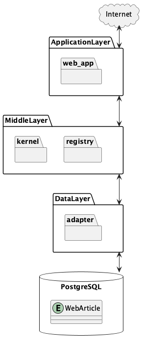

# RUST-PROJECT-TEMPLATE for Web Application

DESCRIPTION


## Quick Start

### Architecture



### Installation

## Usage

### Format

```bash
cargo make format-all
```

### Test

```bash
cargo make nextest
```

### Build

```bash
cargo make compose-build
```

### Start API Server

```bash
cargo make start-server
```

### Build design documents

```bash
cargo make gen-docs
```

### Usage
